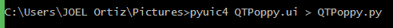

# About the Software

First, you need to have installed:

* Python 2.7
* [PyQT4](https://riverbankcomputing.com/software/pyqt/download)
* Or install [Anaconda](http://continuum.io/downloads)

Once you have installed all the packages, now you must verify the configuration of the file: **pyuic4.bat**

You can find this file in : *C:\Python27\Lib\site-packages\PyQt4*

You can open this file with a Notepad, the configuration must be very similar to the following image:

*Note: When Anaconda is installed, sometimes this file is not properly configured

## GUI design

We degined the GUI in QT designer installed with PyQT4, you can change the GUI as you like.

Once you have finished designing your GUI, now it is necessary that you make a conversion to switch the extension of the file generated by QTdesigner.

For do it, It's necessary that you execute the following command, once you are located in the folder of the projet.

